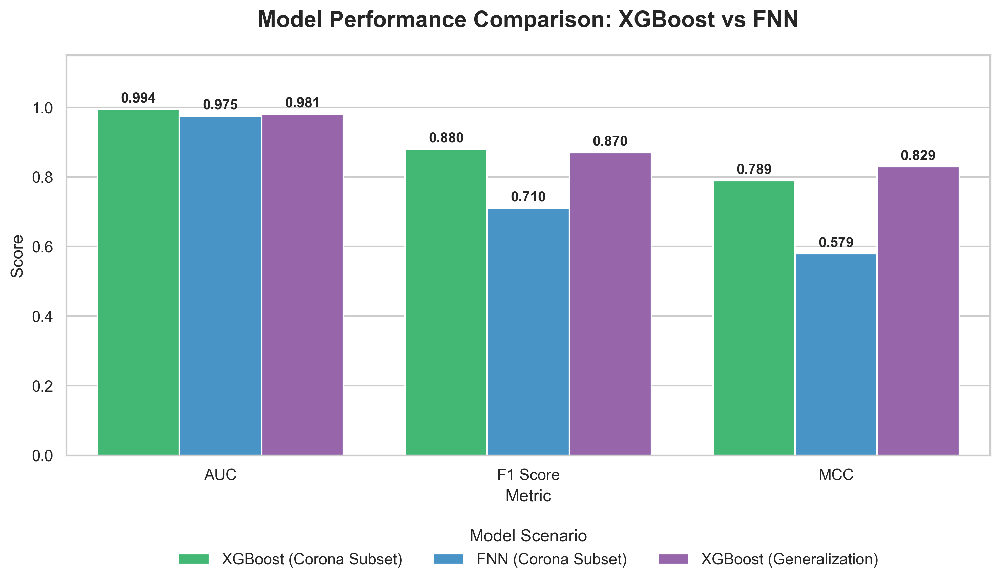

# Training Set Optimization for Linear B-Cell Epitope Prediction

[](https://www.python.org/)
[](https://azure.microsoft.com/en-us/services/machine-learning/)
[](https://www.tensorflow.org/)
[](https://xgboost.readthedocs.io/)
[]()

## 📌 Project Overview

This repository hosts the source code and technical implementation for my MSc Computer Science thesis at Aston University. The project focuses on **optimizing training datasets** to enhance the prediction accuracy of **Linear B-Cell Epitopes (LBCEs)**, which are critical for vaccine design and immunodiagnostics.

The core investigation evaluates the impact of **organism-specific training** (specifically for **Coronavirus**) versus heterogeneous training, using advanced machine learning and feature optimization techniques.

### Key Objectives
- **Feature Selection:** Reduce dimensionality of physicochemical feature sets (~400 features) to identifying the most predictive attributes.
- **Model Comparison:** Benchmark Feedforward Neural Networks (FNN) against Gradient Boosting (XGBoost).
- **Generalization:** Assess how well organism-specific models perform on diverse, multi-pathogen datasets.

---

## 🏗️ System Architecture

The pipeline integrates advanced feature selection with robust classification models.

```mermaid
graph TD
    subgraph Data Processing
        A[Raw Epitope Data] --> B[Preprocessing]
        B --> |SMOTE/Undersampling| C[Balanced Dataset]
        B --> |MinMax Scaler| D[Normalized Features]
    end

    subgraph Feature Optimization
        D --> E[Boruta Algorithm]
        E --> |Confirmed Features| F[Genetic Algorithm (GA)]
        F --> |Optimal Subset| G[Final Feature Set]
    end

    subgraph Modeling
        G --> H{Model Selection}
        H --> I[XGBoost Classifier]
        H --> J[FNN (TensorFlow)]
        I --> |Bayesian Opt| K[Tuned Model]
        J --> |Focal Loss| L[Tuned Model]
    end

    K --> M[Evaluation Metrics]
    L --> M
```

---

## 📊 Performance & Results

The study demonstrated that **XGBoost** trained on the Coronavirus-specific subset significantly outperformed the Neural Network approach and achieved varying degrees of generalization on heterogeneous data.

### Key Metrics
| Metric | XGBoost (Corona) | FNN (Corona) | XGBoost (Generalization) |
| :--- | :---: | :---: | :---: |
| **AUC-ROC** | **0.994** | 0.975 | 0.981 |
| **F1 Score** | **0.880** | 0.710 | 0.870 |
| **MCC** | **0.789** | 0.579 | 0.829 |

### Visual Comparison


> **Insight:** Feature selection reduced the feature space by **77.32%** (from 393 to 88 features) while maintaining or improving predictive accuracy.

---

## 🛠️ Technologies & Methodology

### Machine Learning
- **XGBoost:** Exploited for its efficiency in handling tabular data and feature importance capabilities.
- **Deep Learning (FNN):** Implemented with **TensorFlow/Keras**, utilizing **Focal Loss** to address extreme class imbalance.
- **Feature Selection:**
    - **Boruta:** Used as a wrapper method to find all relevant features.
    - **Genetic Algorithms (DEAP):** Evolutionary strategy to fine-tune the feature subset.

### Cloud & DevOps
- **Azure Machine Learning:** utilized for scalable compute resources and experiment tracking.

### Data Handling
- **SMOTE:** Synthetic Minority Over-sampling Technique to handle dataset imbalance.
- **Bayesian Optimization:** Employed via `scikit-optimize` for efficient hyperparameter tuning.

---

## 🚀 Installation & Usage

1. **Clone the repository:**
   ```bash
   git clone https://github.com/Muh76/Epitope-Prediction.git
   cd Epitope-Prediction
   ```

2. **Install dependencies:**
   ```bash
   pip install -r requirements.txt
   ```

3. **Run the Analysis:**
   - **XGBoost on Corona Subset:**
     ```bash
     python XGBoost-Corona.py
     ```
   - **FNN on Corona Subset:**
     ```bash
     python FNN-Corona.py
     ```

---

## 🎓 Citation

If you use this code or findings in your research, please cite:

> **Comparison of Machine Learning Approaches for Linear B-Cell Epitope Prediction**
> *MSc Thesis, Aston University*

---

*Developed by [Your Name](https://github.com/Muh76)*
